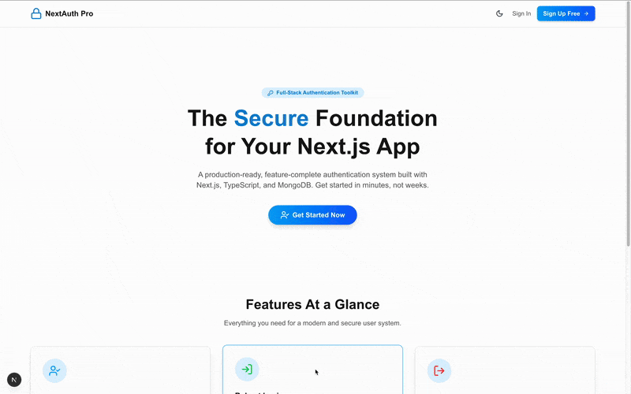

# NextAuth Pro - Full-Stack Next.js Authentication

<p align="center">
  
  
  
  
</p>

A production-ready, feature-complete authentication starter kit built with Next.js, TypeScript, and MongoDB. This project provides a secure, interactive, and beautifully designed foundation for any modern web application.

---

## 🚀 Live Demo & Features

Below is a demonstration of the core user interactions, including the dynamic theme, interactive form validation, and error handling.

<p align="center">
  <!-- IMPORTANT: You should create a GIF of your app and replace this placeholder -->
  
  <em><br>Demonstration of login page with dynamic dark mode and interactive validation.</em>
</p>

### ✨ Key Features

*   **🔐 Robust Authentication**: Secure user login and registration using JWT (JSON Web Tokens) stored in HTTP-only cookies.
*   **👤 User Management**:
    *   Seamless user registration with server-side validation.
    *   Dynamic user profile page (`/profile`) to view account details.
*   **🎨 Dynamic Theming**:
    *   Beautiful, animated Dark/Light mode toggle.
    *   Theme persists in local storage and respects user's system preference.
    *   Built with a modern CSS variable-driven theme (`globals.css`).
*   **✅ Advanced Form Validation**:
    *   Real-time, in-line validation with icons (`CheckCircle`, `AlertCircle`).
    *   Specific API error messages displayed directly under the relevant input field (e.g., "Invalid password", "User not found").
*   **🚀 Interactive UI/UX**:
    *   Fluid animations on all pages and components, powered by **Framer Motion**.
    *   User-friendly feedback with **React Hot Toast** notifications.
*   **🔑 Secure Password Management**:
    *   Password hashing using **bcryptjs**.
    *   Complete "Forgot Password" and "Reset Password" flow with secure, single-use tokens.
*   **🛡️ Protected Routes**: Middleware-based routing (`middleware.ts`) to protect private pages from unauthenticated users.
*   **✉️ Email Verification**:
    *   Secure account verification via email links (`/verifyemail`).
    *   Built with **Nodemailer** for sending emails (`helpers/mailer.ts`).

## 🛠️ Technology Stack

| Category         | Technology                                                                                                   |
| ---------------- | ------------------------------------------------------------------------------------------------------------ |
| **Framework**    | [Next.js](https://nextjs.org/) (App Router)                                                                  |
| **Language**     | [TypeScript](https://www.typescriptlang.org/)                                                                |
| **Styling**      | [Tailwind CSS](https://tailwindcss.com/)                                                                     |
| **Animation**    | [Framer Motion](https://www.framer.com/motion/)                                                              |
| **Database**     | [MongoDB](https://www.mongodb.com/) with [Mongoose](https://mongoosejs.com/)                                 |
| **Icons**        | [Lucide React](https://lucide.dev/)                                                                          |
| **Notifications**| [React Hot Toast](https://react-hot-toast.com/)                                                              |
| **Auth**         | [JWT](https://jwt.io/), [bcryptjs](https://www.npmjs.com/package/bcryptjs)                                   |
| **Email**        | [Nodemailer](https://nodemailer.com/)                                                                        |

## ⚙️ Getting Started

Follow these steps to get the project up and running on your local machine.

### 1. Prerequisites

Make sure you have the following installed:
*   [Node.js](https://nodejs.org/en/) (v18.x or later)
*   [npm](https://www.npmjs.com/) or [yarn](https://yarnpkg.com/)
*   A [MongoDB](https://www.mongodb.com/try/download/community) database instance (local or a free cloud instance from [MongoDB Atlas](https://www.mongodb.com/cloud/atlas/register))

### 2. Installation & Setup

1.  **Clone the repository:**
    ```bash
    git clone https://github.com/your-username/your-repo-name.git
    cd your-repo-name
    ```

2.  **Install dependencies:**
    ```bash
    npm install
    # or
    yarn install
    ```

3.  **Set up environment variables:**
    Create a `.env` file in the root of your project. You can copy the structure from the example below.

### 3. Environment Variables

Create a file named `.env` in the root of the project and add the following variables:

```env

MONGODB_URI=your_mongodb_connection_string
TOKEN_SECRET=your_jwt_secret_key
DOMAIN=http://localhost:3000

# Email configuration
SMTP_HOST=your_smtp_host
SMTP_PORT=587
SMTP_USER=abc123
SMTP_PASS=abc123
SMTP_FROM=your_email_password
EMAIL=your_email
PASSWORD=abc123
EMAIL_SERVICE=gmail

```

Run the development server:

```bash
npm run dev
# or
pnpm dev
```

Open [http://localhost:3000](http://localhost:3000) with your browser to see the result.

## 📁 Project Structure


```
├── src/
│   ├── app/
│   │   ├── api/                # Backend API routes for user actions
│   │   ├── forgotpassword/     # "Forgot Password" page
│   │   ├── login/              # Login page
│   │   ├── profile/            # User profile page
│   │   ├── resetpassword/      # "Reset Password" page
│   │   ├── signup/             # Signup page
│   │   ├── verifyemail/        # Email verification page
│   │   ├── favicon.ico
│   │   ├── globals.css         # Global styles and theme variables
│   │   ├── layout.tsx          # Main application layout
│   │   └── page.tsx            # The homepage component
│   │
│   ├── dbConfig/               # MongoDB connection configuration
│   │
│   ├── helpers/
│   │   ├── getDataFromToken.ts # Helper function to decode JWT from cookies
│   │   └── mailer.ts           # Nodemailer configuration and email sending logic
│   │
│   ├── models/
│   │   └── userModel.js        # Mongoose schema for the 'User' collection
│   │
│   └── middleware.ts           # Handles protected routes and authentication checks
│
├── public/                     # Static assets
│
├── .env                        # Environment variables (ignored by git)
├── next.config.ts              # Next.js configuration
├── package.json
├── postcss.config.mjs          # PostCSS configuration (includes Tailwind)
└── tsconfig.json               # TypeScript configuration

```

## 🎯 Learning Outcomes

This project demonstrates authentication patterns, secure token handling, email integration, and full-stack development best practices using the latest Next.js features.

_Built with AI assistance for frontend development and traditional coding for backend implementation._